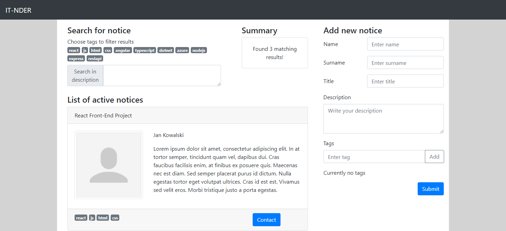

# IT-NDER

> Demo website project for students looking for IT projects teammates.

## Table of contents

- [IT-NDER](#it-nder)
  - [Table of contents](#table-of-contents)
  - [General info](#general-info)
  - [Demo](#demo)
  - [Screenshots](#screenshots)
  - [Technologies](#technologies)
  - [Setup and run](#setup-and-run)
  - [Features](#features)
  - [Issues](#issues)
  - [Status](#status)
  - [Contact](#contact)

## General info

This demo website was created as an exercise in React and React Bootstrap tools. The main focus was on creating fully responsive, mobile friendly web application.

## Demo

Project is available online on Github Pages [here](https://michaltkacz.github.io/it-nder/).

## Screenshots

## Technologies

- HTML / CSS / JS
- [React Bootstrap v1.5.2](https://react-bootstrap.github.io/ 'React Bootstrap page') front-end library.
- [Bootstrap v5.0.0](https://getbootstrap.com/ 'Bootstrap page') front-end toolkit.

## Setup and run

To run it locally, just download repository, run `npm install` in project root folder and then launch `npm start` to start project on local server.

## Features

List of features:

- Adding new notice.
- Dynamic notices filtering by tags and description keywords.
- Responsive website - mobile friendly.

## Issues

When any description filter is given, adding new notice causes displaing all notices, despite applying the filter.

## Status

This is a base version of the project and it will be under further development in the near feature.

## Contact

Created by [@michaltkacz](https://github.com/michaltkacz) - feel free to contact me!
